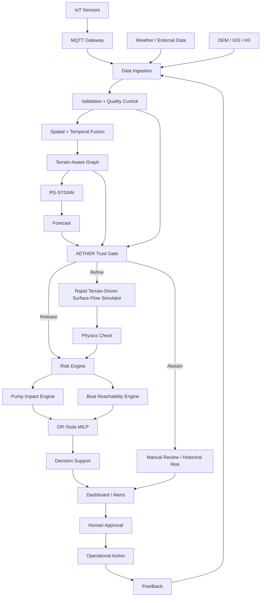
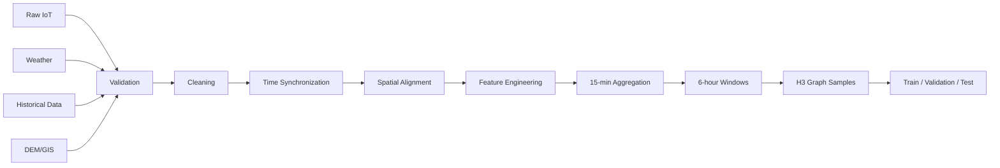
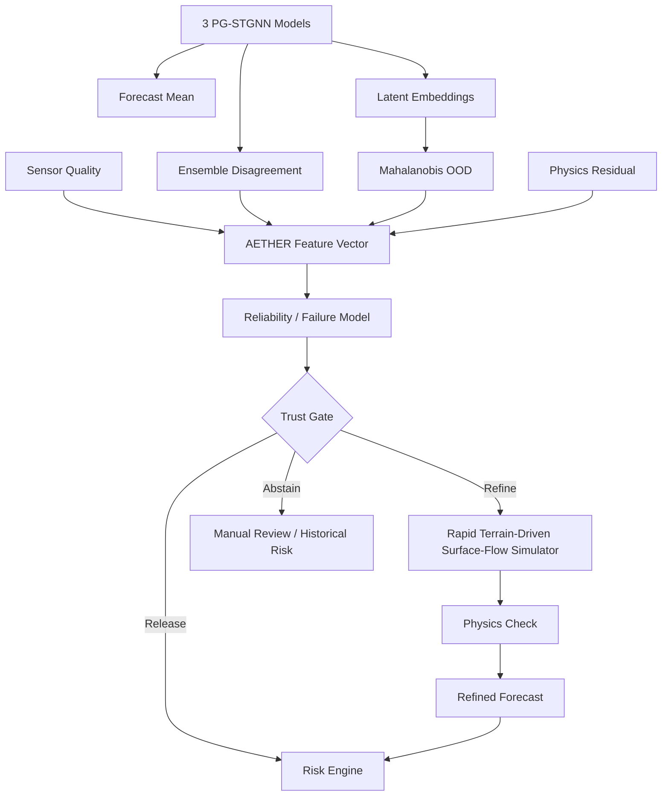
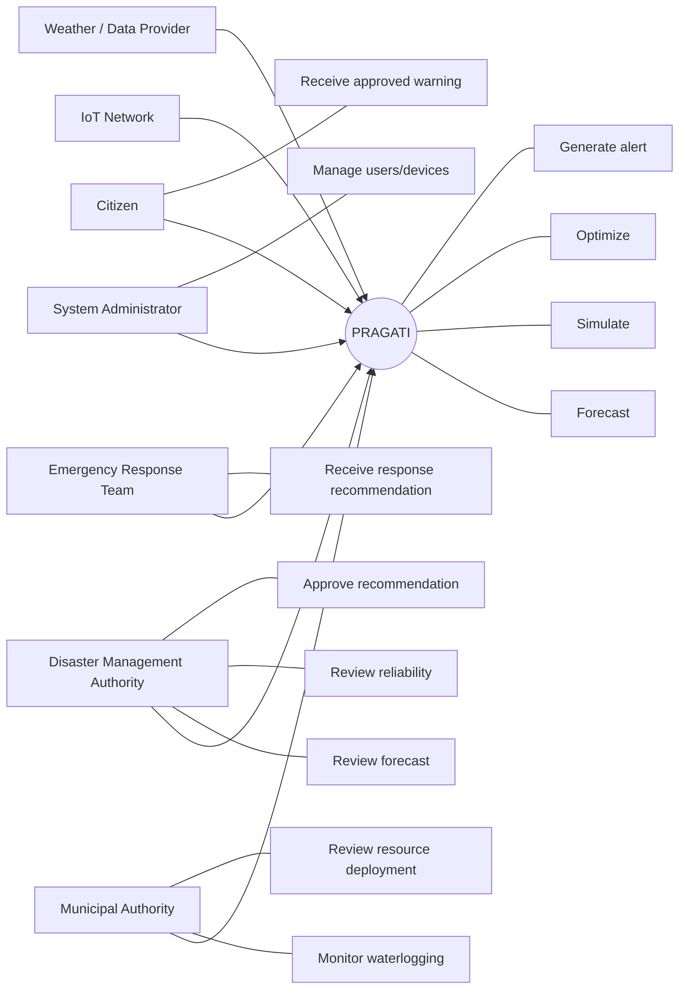
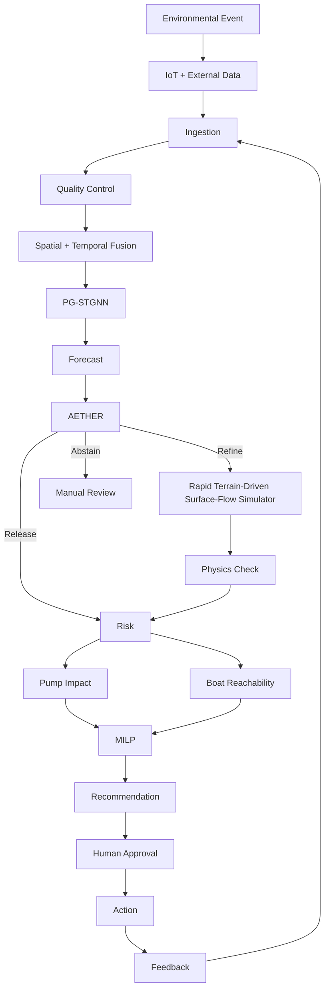
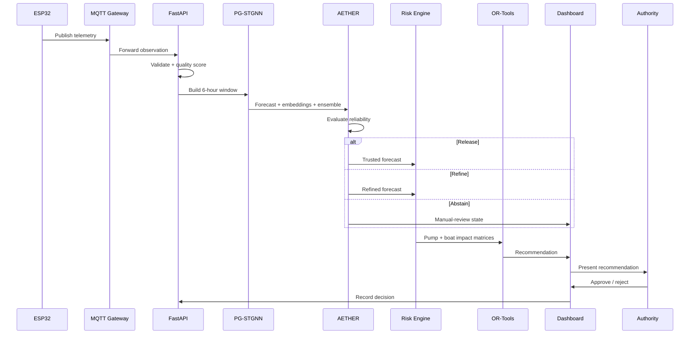
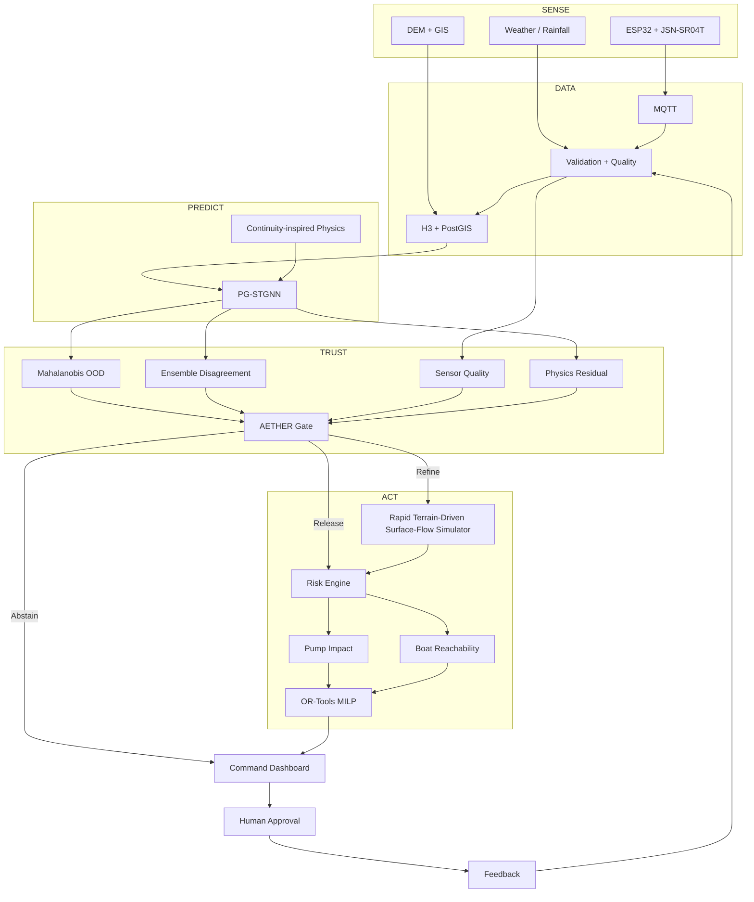

# PRAGATI_MASTER_PROPOSAL_FINAL.md

**Project:** PRAGATI — Predictive Resilience & Adaptive Governance Intelligence  
**Subtitle:** **Predict → Trust → Act**  
**Primary Disaster:** Urban Flooding & Waterlogging  
**Primary User:** Municipal / Disaster Management Command Centre  
**Architecture:** PRAGATI Architecture v2.0 — Scientific Baseline  
**Status:** Architecture Frozen / Implementation Master Plan  

> **Scientific honesty:** This document distinguishes proposed architecture, implementation targets, expected outcomes, and experimentally measured results. No accuracy, deployment, government partnership, lives saved, or cost-saving figure is claimed unless actually demonstrated and measured.

---

# 1. Executive Summary

PRAGATI is a disaster-intelligence and decision-support platform for urban flooding and waterlogging. It combines IoT sensing, rainfall and weather information, geospatial data, terrain-aware graph learning, physics-guided forecasting, reliability estimation, rapid simulation, risk analysis, constrained emergency-resource optimization, visualization, alerting, and human governance.

Its central principle is:

> **Predict → Trust → Act**

**Predict:** A Physics-Guided Spatio-Temporal Graph Neural Network (PG-STGNN) forecasts future inundation depth across an H3-based urban spatial graph.

**Trust:** AETHER acts as a reliability gate. **AETHER is not an uncertainty module; it is a decision gate that can block downstream automation.** It combines latent-space out-of-distribution detection, ensemble disagreement, sensor quality, and physics residuals to decide whether a forecast should be released, refined, or rejected.

**Act:** Trusted flood states are transformed into operational risk. Pumps and boats are modeled separately because they have different physical effects. An OR-Tools MILP recommends constrained resource deployment, while a human operator retains final authority.

## 30-second explanation

> PRAGATI predicts where urban flooding may occur, evaluates whether that prediction can be trusted, and converts sufficiently trusted predictions into constrained response recommendations. When the system detects unusual conditions, bad sensors, model disagreement, or physical inconsistency, it does not blindly automate—it refines the prediction or abstains and requests human review.

## 2-minute explanation

Urban flood management is not simply a forecasting problem. A command centre needs to understand current conditions, anticipate how inundation will evolve, determine whether the forecast is reliable, identify areas likely to become inaccessible, and allocate limited response resources.

PRAGATI represents the study area as a terrain-aware H3 graph. Each spatial cell contains water-state, rainfall, terrain, and quality/context information. GraphSAGE learns spatial relationships and a GRU learns temporal evolution. A continuity-inspired physics regularizer discourages physically implausible water-volume changes. The model forecasts inundation depth for 2-, 4-, and 6-hour horizons using a 15-minute timestep and a 6-hour lookback.

AETHER then evaluates whether the forecast should be trusted. It combines Mahalanobis distance in the learned latent space, disagreement among three PG-STGNN models, sensor quality, and physics residuals. It can release a reliable forecast, invoke a rapid terrain-driven surface-flow simulator for refinement, or abstain when evidence is insufficient.

Only accepted or refined states reach the response layer. Pump deployment is modeled as potential water-depth reduction; boat deployment is modeled as improved rescue reachability. An OR-Tools MILP then selects resources subject to availability, response-window, and operational constraints. Human approval remains mandatory.

The result is a closed operational loop:

```text
SENSE → UNDERSTAND → PREDICT → TRUST → SIMULATE → OPTIMIZE → RECOMMEND → HUMAN ACTION → FEEDBACK
```

---

# 2. Problem Statement

## 2.1 Real-world problem

Urban flooding and waterlogging are spatially heterogeneous, rapidly changing, and influenced by rainfall, terrain, surface flow, infiltration, drainage limitations, and infrastructure.

The operational questions are:

1. Where is water accumulating?
2. Where will it move?
3. How deep could it become?
4. How will the situation evolve over the next few hours?
5. Can the forecast be trusted?
6. What if sensors are wrong or unavailable?
7. What if the event is outside the training distribution?
8. Which areas may become inaccessible?
9. Where should limited pumps and boats be deployed?
10. When should the system refuse to automate?

## 2.2 Why prediction is not enough

A conventional prediction pipeline ends at:

```text
Data → Model → Forecast
```

A disaster-intelligence pipeline must continue:

```text
Data
 ↓
Forecast
 ↓
Reliability
 ↓
Risk
 ↓
Response planning
 ↓
Human approval
 ↓
Action
 ↓
Feedback
```

A highly accurate average forecast can still be unsafe if it does not identify its failure conditions.

## 2.3 Core gaps

| Gap | Consequence | PRAGATI response |
| :--- | :--- | :--- |
| Fragmented data | Incomplete situational awareness | Multi-source fusion |
| Sparse sensing | Missing local conditions | IoT + spatial representation |
| Static thresholds | Limited adaptation | Learned spatial-temporal model |
| Black-box prediction | Physical implausibility risk | Terrain + continuity guidance |
| Hidden model failure | Unsafe downstream decisions | AETHER trust gate |
| Sensor corruption | False state estimates | Sensor-quality modeling |
| Distribution shift | Extreme-event failures | OOD + ensemble disagreement |
| Prediction/action disconnect | Manual translation burden | Risk + optimization |
| Generic resource model | Operationally incorrect assumptions | Separate pump/boat models |
| Over-automation | Governance risk | Human-in-the-loop |

---

# 3. Existing System / Current State of the Art

PRAGATI does not claim existing flood systems are absent. Traditional monitoring, numerical hydrology, hydraulic simulation, machine learning, graph neural networks, physics-guided learning, remote sensing, and early-warning systems all solve important subproblems.

## 3.1 Gauge-based monitoring

**Strength:** direct measurements and operational simplicity.

**Limitation:** sparse spatial coverage and limited ability to describe localized urban waterlogging between gauges.

**PRAGATI:** supplements measurements with a spatial H3 representation.

## 3.2 Weather forecasting

Rainfall forecasts provide forcing information but do not directly produce an operational urban inundation state.

**PRAGATI:** fuses rainfall with terrain and current water state.

## 3.3 Physics-based models

Physics models provide interpretable and scenario-based simulations but may require detailed drainage, terrain, boundary, infrastructure, and calibration information.

**PRAGATI MVP:** uses a lightweight terrain-driven surface-flow simulator rather than claiming a complete municipal hydraulic model.

## 3.4 ML/DL forecasting

LSTM, GRU, Transformer and GNN models can learn nonlinear temporal and spatial relationships.

**Gap:** predictive accuracy alone does not establish reliability under distribution shift or sensor failure.

## 3.5 GNNs

GNNs naturally represent relational spatial systems.

**PRAGATI:** uses H3 cells with terrain-aware edge attributes.

## 3.6 Physics-guided ML

Physics can be incorporated into features, graph structure, losses, simulation, or validation.

**PRAGATI:** uses a continuity-inspired regularization term and terrain-informed graph structure.

## 3.7 Digital twins

PRAGATI does **not** claim a full digital twin for the MVP.

The appropriate term is:

> **Digital-twin-inspired architecture**

because the prototype connects sensing, spatial representation, prediction, simulation, and feedback without claiming full physical fidelity.

---

# 4. PRAGATI Vision

PRAGATI is designed around:

- **Predictive:** forecasts future state.
- **Resilient:** degrades gracefully when inputs or services fail.
- **Adaptive:** spends additional computation when needed.
- **Governance-aware:** keeps consequential decisions under human control.

The philosophy is:

```text
Predictive intelligence
        ↓
Reliability awareness
        ↓
Operational intelligence
        ↓
Human-governed action
```

---

# 5. Product Definition

## 5.1 Primary user

Municipal / Disaster Management Command Centre.

## 5.2 Secondary users

- Emergency response teams.
- Municipal field operators.
- Infrastructure operators.
- System administrators.
- Researchers.
- Citizens through approved warning channels.

## 5.3 Product interfaces

### Command dashboard

Central operational interface.

### Live GIS map

Shows:
- current water state,
- forecast depth,
- risk,
- reliability,
- affected areas,
- resource candidates.

### Sensor monitoring

Shows:
- latest reading,
- timestamp,
- quality,
- connectivity,
- anomalies.

### Forecast view

Shows 2-, 4-, and 6-hour inundation forecasts.

### AETHER view

Shows:
- Release / Refine / Abstain state,
- reliability score,
- OOD signal,
- disagreement,
- sensor quality,
- physics residual.

### Simulation view

Provides rapid scenario refinement.

### Resource view

Separates:
- pump recommendations,
- boat recommendations.

### Alert view

Shows:
- severity,
- affected area,
- lead time,
- reliability,
- recommendation,
- approval state.

### Incident replay

Allows synthetic and historical scenarios to be replayed.

---

# 6. Product Requirements Document

## 6.1 Functional requirements

| ID | Requirement | Priority |
| :--- | :--- | :--- |
| FR-001 | Ingest IoT telemetry | Must |
| FR-002 | Validate telemetry schema | Must |
| FR-003 | Compute sensor quality | Must |
| FR-004 | Ingest rainfall/weather data | Must |
| FR-005 | Maintain H3 spatial representation | Must |
| FR-006 | Derive terrain graph attributes | Must |
| FR-007 | Construct temporal windows | Must |
| FR-008 | Run PG-STGNN inference | Must |
| FR-009 | Produce multi-horizon depth forecasts | Must |
| FR-010 | Run AETHER | Must |
| FR-011 | Support Release / Refine / Abstain | Must |
| FR-012 | Invoke rapid simulation | Must |
| FR-013 | Compute risk | Must |
| FR-014 | Compute pump impact | Must |
| FR-015 | Compute boat reachability impact | Must |
| FR-016 | Run constrained optimization | Must |
| FR-017 | Display results on GIS dashboard | Must |
| FR-018 | Require human approval | Must |
| FR-019 | Audit forecasts and decisions | Must |
| FR-020 | Support anomaly injection | Must |
| FR-021 | Support incident replay | Should |
| FR-022 | Expose versioned APIs | Should |
| FR-023 | Monitor model/data health | Should |
| FR-024 | Provide RBAC administration | Should |

## 6.2 Non-functional requirements

- **Latency:** engineer for interactive MVP operation; final targets must be benchmarked.
- **Availability:** core demo should work offline.
- **Scalability:** services should be independently scalable.
- **Security:** authentication, authorization, device identity and audit logs.
- **Explainability:** expose principal reliability and recommendation factors.
- **Fault tolerance:** failures must produce explicit degraded states.
- **Maintainability:** versioned data, models and APIs.
- **Cost efficiency:** prefer lightweight MVP components.

---

# 7. Complete System Architecture



AETHER is a deliberate **chokepoint**. A low-trust prediction must not silently proceed to resource optimization.

---

# 8. IoT Hardware System

## 8.1 Primary hardware

| Component | Choice | Role |
| :--- | :--- | :--- |
| Microcontroller | ESP32 | Sensor acquisition and communication |
| Water-level sensor | JSN-SR04T | Non-contact water-depth measurement |
| Physical environment | Transparent tank | Controlled flood/water-level demonstration |
| Communication | Wi-Fi + MQTT | Telemetry transport |
| Compute | Laptop | Local inference and dashboard |

Additional sensors can be supported later but must not compromise the core demo.

## 8.2 Mounting

The JSN-SR04T is mounted vertically above a calibrated tank.

```text
       JSN-SR04T
           ↓
    ┌──────────────┐
    │              │
    │    WATER     │
    │~~~~~~~~~~~~~~│
    │              │
    └──────────────┘
       fixed datum
```

Depth:

\[ d = D_{zero} - D_{measured} \]

The calibration reference is fixed before the demo.

## 8.3 Logical timestep

Physical readings may occur more frequently, then be aggregated into the model's 15-minute timestep.

Model configuration:
- timestep: 15 minutes,
- lookback: 6 hours = 24 timesteps,
- forecast: 2 / 4 / 6 hours = 8 / 16 / 24 future timesteps.

---

# 9. Hardware Demonstration

The physical demo contains:

1. Transparent tank.
2. ESP32.
3. JSN-SR04T.
4. Fixed mounting stand.
5. Laptop.
6. PRAGATI dashboard.
7. Optional miniature response-resource markers.

The judge changes water level physically.

```text
Physical water change
        ↓
JSN-SR04T
        ↓
ESP32
        ↓
MQTT
        ↓
Backend
        ↓
Dashboard
```

Future rainfall is controlled using a dashboard slider. The slider is explicitly labelled as **demonstration forcing**, not a physical rainfall measurement.

---

# 10. Data Ingestion Architecture

## 10.1 Real-time

- IoT telemetry.
- Rainfall observations.
- Weather forecast/forcing where available.

## 10.2 Historical

Potential data categories:
- hydrological observations,
- meteorological observations,
- DEM,
- land-use/context,
- administrative boundaries,
- population/contextual data,
- satellite observations where available.

Actual acquisition must be verified before submission.

## 10.3 Normalized observation

```json
{
  "device_id": "node-001",
  "timestamp": "ISO-8601",
  "latitude": 0.0,
  "longitude": 0.0,
  "water_depth_m": 0.0,
  "rainfall_mm": 0.0,
  "quality_score": 1.0
}
```

## 10.4 Quality control

- schema validation,
- timestamp checks,
- duplicate detection,
- physical range checks,
- rate-of-change checks,
- stale-data detection,
- missingness,
- communication status.

---

# 11. Data Engineering Pipeline



## 11.1 H3 resolution

The frozen baseline uses **H3 resolution 9**.

H3 is used for spatial indexing and representation; it is not itself a hydraulic model.

## 11.2 Terrain features

Each H3 cell should include, where data permits:

- minimum elevation,
- maximum elevation,
- mean elevation,
- elevation variance,
- slope,
- flow accumulation,
- aspect or terrain-direction features,
- local depression indicators where available.

---

# 12. Simulation Environment

## 12.1 Purpose

The simulator provides:

- controlled ground truth,
- physically plausible synthetic events,
- extreme-event scenarios,
- failure scenarios,
- what-if analysis,
- rapid refinement.

It is not a replacement for field validation.

## 12.2 Simulator terminology

Use:

> **Rapid Terrain-Driven Surface-Flow Simulator**

Avoid claiming:
- full underground drainage model,
- full hydraulic solver,
- Mumbai digital twin.

## 12.3 Water balance

For cell \(i\):

\[ V_i(t) = d_i(t)A_i \]

and approximately:

\[ \Delta V_i = P_i + I_i - O_i - F_i \]

where \(P\) is rainfall contribution, \(I\) inflow, \(O\) outflow and \(F\) simplified infiltration.

## 12.4 Scenario generation

Vary:

- rainfall intensity,
- rainfall duration,
- antecedent water state,
- infiltration parameters,
- terrain conditions,
- sensor noise,
- missing observations,
- sensor corruption.

Simulation scenarios must be controlled and physically motivated rather than arbitrary random data.

---

# 13. Physics-Guided AI

## 13.1 Pure ML limitation

Purely learned models can learn statistical relationships that become unreliable when conditions change.

## 13.2 Pure physics limitation

High-fidelity urban hydraulic simulation may require detailed drainage and infrastructure information unavailable to the MVP and may be computationally expensive.

## 13.3 PRAGATI approach

PRAGATI uses physical information in:

1. spatial graph construction,
2. terrain features,
3. simulation,
4. continuity-inspired loss,
5. reliability assessment.

## 13.4 Terminology discipline

PRAGATI should be described as:

> **Physics-guided learning with continuity-inspired regularization and terrain-aware spatial structure.**

It should not claim that the MVP solves full Saint-Venant or Navier-Stokes equations.

---

# 14. PG-STGNN

## 14.1 Graph

\[ G=(V,E) \]

where \(V\) represents H3 cells and \(E\) represents spatial relationships.

The graph is **not called a DAG**.

## 14.2 Edges

Edges use terrain-aware attributes:

- elevation difference,
- slope,
- flow-direction compatibility,
- flow accumulation,
- distance.

D8-compatible terrain processing determines likely downhill relationships.

## 14.3 Node features

A node representation can contain:

\[ x_i^t = [d_i^t, r_i^t, e_i^{min}, e_i^{max}, e_i^{var}, s_i, a_i, q_i^t, \ldots] \]

where \(d\) is depth, \(r\) rainfall, terrain statistics are represented explicitly, \(a\) is flow accumulation and \(q\) sensor quality.

Actual feature availability is dataset dependent.

## 14.4 Model

The frozen baseline is:

```text
15-minute input sequence
        ↓
GraphSAGE
        ↓
Spatial embeddings
        ↓
GRU
        ↓
Temporal representation
        ↓
Multi-horizon prediction head
        ↓
2h / 4h / 6h inundation depth
```

## 14.5 Ensemble

Three independently seeded PG-STGNN models provide an ensemble disagreement signal for AETHER.

## 14.6 Target

The primary target is:

> **Inundation depth in metres above local ground level.**

---

# 15. PG-STGNN Loss

The final loss must be empirically validated.

A candidate structure is:

\[ L = L_{pred} + \lambda_{phys}L_{continuity} + \lambda_{spatial}L_{spatial} + \lambda_{temporal}L_{temporal} \]

Optional terms should only remain if ablation experiments justify them.

**We will report the final loss formulation and λ values in the experimental results.**

## 15.1 Prediction loss

\[ L_{pred} = \frac{1}{NTH} \sum_{i,t,h} (\hat{d}_{i,t+h}-d_{i,t+h})^2 \]

## 15.2 Continuity-inspired loss

Using:

\[ V_i(t)=d_i(t)A_i \]

define an approximate residual:

\[ R_i = \Delta V_{pred,i} - (P_i+I_i-O_i-F_i) \]

Then:

\[ L_{continuity} = \frac{1}{N} \sum_i R_i^2 \]

The exact numerical formulation, weighting and discretization must be calibrated.

> **Important:** this is a continuity-inspired regularizer, not a claim of solving complete shallow-water equations.

---

# 16. AETHER — Detailed Integration

AETHER exists because:

> **A forecast can be plausible and still be wrong.**

The system therefore asks:

1. What does the model predict?
2. How reliable is the prediction?
3. What should the system do if reliability is low?

## 16.1 Actions

### Release

Forecast proceeds to risk analysis.

### Refine

Run rapid terrain-driven surface-flow simulation and physical consistency checking.

### Abstain

Suppress downstream automated optimization and request human review.

---

# 17. AETHER Architecture



## 17.1 Mahalanobis OOD

Use the 64-dimensional penultimate-layer embedding \(z\).

Estimate training distribution parameters \(\mu,\Sigma\).

\[ D_M(z) = \sqrt{(z-\mu)^T\Sigma^{-1}(z-\mu)} \]

A high value indicates representation-space unfamiliarity.

This is evidence, not proof of model failure.

## 17.2 Ensemble disagreement

For three forecasts:

\[ \hat{y}_1,\hat{y}_2,\hat{y}_3 \]

calculate mean and variance. High disagreement is treated as a model-instability signal.

## 17.3 Sensor quality

Include:

- missingness,
- stale data,
- invalid range,
- abrupt changes,
- connectivity,
- local consistency where available.

## 17.4 Physics residual

The continuity residual is used as a physical-plausibility signal.

## 17.5 Learned gate

The baseline AETHER model combines:

```text
OOD
+ Ensemble disagreement
+ Sensor quality
+ Physics residual
+ Event difficulty
        ↓
Reliability / failure estimate
        ↓
Release / Refine / Abstain
```

Thresholds should be calibrated using validation failure cases.

---

# 18. AETHER Failure Training

AETHER should be trained/evaluated against explicit failure scenarios.

## Extreme rainfall

Generate events beyond common training conditions.

## Sensor corruption

Inject:
- spikes,
- bias,
- drift,
- stuck values,
- missing values.

## Missing data

Simulate communication outages and incomplete input windows.

## Distribution shift

Evaluate scenarios outside the training distribution.

## Physics inconsistency

Include forecasts with elevated continuity residuals.

AETHER should learn from actual forecasting error or defined failure criteria rather than arbitrary confidence labels.

---

# 19. Model Training Strategy

## Stage 1 — Baselines

Persistence, statistical baseline.

## Stage 2 — Temporal baseline

LSTM/GRU.

## Stage 3 — Spatial baseline

Graph model.

## Stage 4 — ST-GNN

Graph + temporal learning without physics.

## Stage 5 — PG-STGNN

Add physics-guided regularization.

## Stage 6 — Ensemble

Train three independent models.

## Stage 7 — AETHER

Train failure/reliability model.

## Stage 8 — End-to-end

Integrate prediction, trust, simulation and action layers.

## Data splitting

Avoid random row-level splitting when it creates leakage.

Use:
- temporal holdout,
- geographic holdout where possible,
- extreme-event holdout.

---

# 20. Baseline Models

| Model | What it proves |
| :--- | :--- |
| Persistence | Whether learning beats current-state continuation |
| Historical/statistical | Whether neural complexity is justified |
| LSTM/GRU | Value of temporal learning |
| Transformer | Strong sequence baseline |
| ST-GNN | Value of spatial-temporal graph learning |
| Physics simulator | Behaviour of physical surrogate |
| PG-STGNN | Value of physics-guided learning |
| PG-STGNN + AETHER | Value of reliability-aware inference |

No superiority claim is valid without measured comparison.

---

# 21. Evaluation

## Forecasting

- MAE,
- RMSE,
- \(R^2\),
- NSE where justified,
- KGE where justified,
- peak-depth error,
- peak-timing error.

## Flood extent

After applying an operational depth threshold:
- IoU,
- F1,
- precision,
- recall.

## Reliability

- ECE,
- calibration curves,
- selective risk,
- coverage,
- risk-coverage curves,
- failure-detection AUROC,
- failure-detection AUPRC.

## Operational

- inference latency,
- refinement latency,
- optimization latency,
- false alarms,
- missed events,
- lead time,
- compute cost.

Accuracy alone is not sufficient because an operational model must also understand when it may be unreliable.

---

# 22. Experimental Design

## Research questions

**RQ1:** Does terrain-aware graph structure improve spatial inundation forecasting?

**RQ2:** Does continuity-inspired physics regularization improve physical consistency?

**RQ3:** Can AETHER detect forecast failure better than a single confidence measure?

**RQ4:** Does selective refinement improve difficult-case performance?

**RQ5:** Does reliability-aware gating reduce unsafe downstream automation?

**RQ6:** Does constrained optimization improve response-resource objectives?

## Hypotheses

- H1: Terrain-aware graph modeling improves forecasting relative to temporal-only baselines.
- H2: Physics regularization improves physical consistency.
- H3: Multi-signal AETHER detects failures better than single-signal confidence.
- H4: Selective refinement improves difficult-event predictions.
- H5: Constrained optimization improves objective value under fixed resources.

## Ablations

Remove:
- terrain,
- graph,
- physics loss,
- ensemble,
- OOD,
- sensor-quality signal,
- physics residual,
- AETHER,
- refinement.

---

# 23. Core USP

> **PRAGATI does not merely predict flooding—it estimates whether its prediction can be trusted and converts trusted predictions into constrained response actions.**

The differentiating chain is:

```text
Physics-guided spatial forecasting
          +
Reliability-aware inference
          +
Selective refinement
          +
Resource-impact modeling
          +
Constrained optimization
          +
Human governance
```

Generic claims such as "AI-powered" or "real-time" are not the USP.

---

# 24. Use Case Diagram



---

# 25. Complete Workflow Diagram



---

# 26. Sequence Diagram



---

# 27. Deployment Architecture

## MVP

Use Docker Compose:

```text
Local Laptop
├── React dashboard
├── FastAPI
├── MQTT broker
├── PostgreSQL + PostGIS
├── AI inference service
├── AETHER service
├── Rapid terrain-driven surface-flow simulator
├── OR-Tools optimizer
└── Monitoring/logging
```

Kubernetes is deliberately not required for the MVP.

## Production evolution

```text
IoT Edge
 ↓
Secure Gateway
 ↓
Message Broker
 ↓
Streaming/Data Layer
 ↓
Feature/Data Layer
 ↓
Model Serving
 ↓
AETHER
 ↓
Risk + Optimization
 ↓
API Gateway
 ↓
Command Centre
```

Kubernetes becomes appropriate only if deployment scale justifies its complexity.

---

# 28. Technology Stack

| Layer | MVP | Rationale | Production evolution |
| :--- | :--- | :--- | :--- |
| Frontend | React | Mature UI ecosystem | Scaled web platform |
| GIS | MapLibre GL JS | Flexible map rendering | Scaled tile infrastructure |
| Backend | FastAPI | Native Python/AI integration | Service architecture |
| AI | PyTorch | Research flexibility | Optimized serving |
| GNN | PyTorch Geometric | Graph ML support | Optimized inference |
| Database | PostgreSQL | Reliable relational core | Managed PostgreSQL |
| GIS DB | PostGIS | Spatial operations | Managed PostGIS |
| Messaging | MQTT | IoT-friendly | Broker cluster |
| Spatial index | H3 | Hierarchical spatial representation | Distributed spatial processing |
| Terrain | GDAL/raster tools | DEM processing | Scalable geospatial processing |
| Simulation | Python / NumPy / Landlab as appropriate | Fast iteration | Dedicated simulation service |
| Optimization | OR-Tools | Practical MILP | Solver service |
| Deployment | Docker Compose | MVP simplicity | Kubernetes if justified |
| Monitoring | Prometheus/Grafana as needed | Metrics | Full observability |
| CI/CD | GitHub Actions | Accessible automation | Enterprise pipeline |
| Auth | JWT/RBAC | MVP simplicity | OIDC/IAM |
| Training | Available GPU resources / Colab Pro | Cost-conscious | Institutional/cloud GPU |

Every choice remains subject to implementation benchmarking.

---

# 29. Security

## Device

- device identity,
- credential management,
- secure configuration,
- telemetry validation.

## API

- HTTPS in production,
- JWT/OIDC,
- RBAC,
- rate limiting,
- input validation.

## Integrity

Store:
- device ID,
- event timestamp,
- ingestion timestamp,
- validation state.

## Audit

Record:
- forecast,
- AETHER state,
- simulation,
- recommendation,
- human decision,
- timestamps.

## Threat model

Consider:
- false-data injection,
- compromised sensors,
- replay attacks,
- API abuse,
- manipulated forcing,
- unauthorized administration.

---

# 30. Reliability and Fault Tolerance

| Failure | Behaviour |
| :--- | :--- |
| Sensor fails | Reduce quality, down-weight/exclude, reassess trust |
| Sensor sends spikes | Quality-control flag + AETHER |
| Internet fails | Local/offline MVP remains usable |
| Gateway fails | Buffer where feasible and mark gaps |
| Weather source fails | Use last valid/controlled fallback and expose degraded state |
| Model service fails | Block downstream automation |
| Database fails | Recover from local/durable storage in production |
| AETHER abstains | Suppress optimization and request manual review |
| Unprecedented scenario | Show historical risk context and manual-review warning |

The system must fail visibly rather than fail silently.

---

# 31. Challenges and Solutions

| Challenge | Why it matters | Solution | Residual risk |
| :--- | :--- | :--- | :--- |
| Sparse real data | Limits learning | Historical + synthetic + prototype data | Generalization remains limited |
| Missing drainage data | Full hydraulic realism unavailable | Terrain-driven surface simulator | Underground flow omitted |
| H3 heterogeneity | Cell contains varied terrain | DEM statistics | Sub-cell effects simplified |
| Extreme events | Model may fail | AETHER OOD + ensemble | Detection imperfect |
| Sensor corruption | Bad state estimate | Quality signals + anomaly handling | Coordinated attacks difficult |
| Physics simplification | Loss is not full hydraulics | Explicit terminology | High-fidelity validation future |
| Historical labels | Limited spatial ground truth | Event/ward-level validation | Lower resolution |
| Optimization assumptions | Field impact is complex | Explicit impact matrices | Real deployment needs richer data |
| Demo failure | Integration risk | Offline-first + replay path | Physical hardware risk |
| Compute limits | Ensemble costs more | Compact graph/model | Scaling needs engineering |

---

# 32. Social Impact

Potential impact areas:

- earlier identification of high-risk zones,
- improved situational awareness,
- more informed emergency-resource allocation,
- better handling of unreliable sensing,
- explicit recognition of uncertain forecasts,
- support for vulnerable and isolated communities.

No numerical life-saving claim should be made without field evidence.

---

# 33. Economic Impact

Potential benefits:

- improved pump utilization,
- better rescue-resource allocation,
- reduced coordination overhead,
- better prioritization of critical areas,
- reduced response inefficiency.

Exact savings must be scenario estimates unless measured.

---

# 34. Environmental Impact

Potential applications include:

- climate adaptation,
- water-management planning,
- recurring waterlogging analysis,
- resilient infrastructure planning,
- environmental monitoring.

Edge sensing and lightweight inference can reduce unnecessary data transmission and computation.

---

# 35. Scalability

## One locality

Small graph + few sensors + local gateway.

## City

Large H3 graph + many IoT nodes + centralized services.

## State

Multiple geographic partitions and operational zones.

## National

Multi-tenant, region-aware, standardized service architecture.

Scaling dimensions:

- sensor count,
- graph size,
- message rate,
- inference throughput,
- storage,
- geospatial processing,
- model serving.

---

# 36. Government Integration

PRAGATI should be described as **integration-ready**, not already integrated with government systems.

Possible integration mechanisms:

- authenticated APIs,
- GIS layers,
- command dashboards,
- alert channels,
- incident systems,
- existing sensor networks,
- approved operational workflows.

Human authorization remains essential for consequential actions.

---

# 37. MVP Definition

## Must-have

1. ESP32 + JSN-SR04T.
2. MQTT telemetry.
3. Local backend.
4. H3 representation.
5. DEM-derived terrain graph.
6. PG-STGNN.
7. AETHER.
8. Rapid terrain-driven surface-flow simulator.
9. Risk map.
10. Pump + boat impact models.
11. OR-Tools optimization.
12. React GIS dashboard.
13. Offline-first Docker deployment.
14. Anomaly injection.
15. End-to-end demonstration.

## Should-have

- historical incident replay,
- richer weather inputs,
- anomaly visualization,
- calibration plots,
- experiment tracking.

## Nice-to-have

- satellite validation,
- additional IoT sensors,
- advanced 3D visualization,
- cloud deployment.

## Future research

- high-fidelity hydraulic coupling,
- live satellite assimilation,
- multi-city training,
- advanced uncertainty methods,
- adaptive sensing,
- field pilots.

---

# 38. SIH Hardware Demo Strategy

### Minute 0–1 — Problem

Show the flood map and establish the prediction-versus-decision gap.

### Minute 1–2 — Physical sensing

Change tank water level and show live sensor telemetry.

### Minute 2–3 — Future rainfall

Use the dashboard rainfall slider as controlled future forcing.

### Minute 3–4 — Forecast

Display future inundation depth.

### Minute 4–5 — Trust

Show AETHER's reliability state and contributing signals.

### Minute 5–6 — Inject anomaly

Use the **Inject Anomaly** control.

The expected demonstration behaviour is a transition toward **ABSTAIN** or **REFINE**, depending on the configured failure case.

### Minute 6–7 — Refinement

Run the rapid terrain-driven surface-flow simulator.

### Minute 7–8 — Risk

Display affected zones and risk.

### Minute 8–9 — Action

Show separate pump and boat recommendations.

### Minute 9–10 — Governance

Show human approval and close:

> **Predict → Trust → Act.**

---

# 39. Jury Presentation Strategy

## Opening

> "Most flood systems answer where water is. PRAGATI asks three questions: where will it go, can we trust that prediction, and what should we do with the resources we have?"

## Story

1. Problem.
2. Existing gap.
3. Core insight.
4. Architecture.
5. PG-STGNN.
6. AETHER.
7. Hardware demo.
8. Resource optimization.
9. Evaluation.
10. Scalability.
11. Governance.

## Closing

> "PRAGATI does not automate disaster governance. It makes disaster intelligence more predictive, more transparent, and more cautious about when AI should be trusted."

---

# 40. Expected Jury Questions

## Why not an existing flood forecasting system?

PRAGATI does not claim to replace existing systems. Its focus is the reliability-gated transition from forecasting to constrained response support.

## Why AI?

AI is useful for nonlinear spatial-temporal relationships. Physics and operational constraints provide complementary structure.

## Why GNN?

The problem is relational. Neighbouring spatial regions influence one another.

## Why not Transformer?

Transformer is a strong baseline and should be evaluated rather than dismissed.

## Are you solving Navier-Stokes?

No. The MVP uses terrain-aware graph learning, a continuity-inspired regularizer and a rapid surface-flow surrogate.

## What is novel?

The strongest defensible claim is the reliability-gated prediction-to-action architecture and the research investigation of selective refinement under difficult conditions.

## What if sensors fail?

Sensor quality is explicitly modeled. AETHER can trigger refinement or abstention.

## What if the model is wrong?

AETHER is specifically designed to identify conditions associated with model failure and prevent blind downstream automation.

## Why not just show confidence?

A raw confidence value is not necessarily calibrated to failure. AETHER combines multiple independent signals and is trained on failure cases.

## What happens during an unprecedented event?

OOD and ensemble disagreement can identify unfamiliar states. If reliability is insufficient, the system abstains and requests manual review.

## Why pumps and boats?

They have different mechanisms: pumps reduce water depth; boats improve reachability to isolated areas.

## Why 15 minutes?

It balances urban event dynamics, sensor aggregation and computational cost. The final choice should be validated experimentally.

## Why six hours?

It captures recent antecedent conditions while keeping the MVP tractable. History length should be tested experimentally.

## Why no Kubernetes?

Docker Compose is adequate for the MVP and avoids unnecessary operational complexity.

## Can government trust it?

It is decision support, not autonomous authority. Reliability information and human approval are explicit.

---

# 41. Research Novelty

## Engineering novelty

Integration of:
- IoT,
- H3,
- terrain-aware graph learning,
- physics-guided forecasting,
- reliability gating,
- simulation,
- resource optimization.

Integration alone should not be claimed as scientific novelty.

## Scientific novelty

The research should test whether a multi-signal reliability gate with selective refinement can improve operational safety of spatial flood forecasting.

The exact literature-grounded novelty claim must be finalized after systematic literature review and experimental evidence.

## Product novelty

A unified:

```text
Forecast → Trust → Response
```

workflow.

## Operational novelty

The system explicitly models **when not to automate**.

---

# 42. Research Contribution

| Contribution | Problem | Method | Evidence | Limitation |
| :--- | :--- | :--- | :--- | :--- |
| Terrain-aware PG-STGNN | Spatial forecasting | GraphSAGE + GRU + terrain | Benchmark | Graph quality |
| Physics regularization | Physical inconsistency | Continuity-inspired loss | Ablation + residuals | Simplified physics |
| AETHER | Hidden model failure | OOD + disagreement + quality + residual | Calibration + failure detection | Imperfect |
| Selective refinement | Expensive inference | Trigger simulator selectively | Error/compute trade-off | Surrogate model |
| Resource optimization | Prediction/action gap | Separate impact matrices + MILP | Objective comparison | Simplified constraints |

---

# 43. Implementation Roadmap

## Phase 0 — Architecture

Deliver:
- repository,
- API contracts,
- schemas,
- architecture,
- experiment protocol.

## Phase 1 — Data

Deliver:
- DEM processing,
- H3 graph,
- terrain features,
- normalized datasets.

## Phase 2 — Baselines

Implement persistence, statistical, LSTM/GRU and graph baselines.

## Phase 3 — PG-STGNN

Implement GraphSAGE + GRU + multi-horizon prediction + physics loss.

## Phase 4 — AETHER

Implement ensemble, embeddings, Mahalanobis OOD, disagreement, sensor quality, physics residual and gate.

## Phase 5 — IoT

Implement ESP32, JSN-SR04T, calibration and MQTT.

## Phase 6 — Simulation

Implement terrain routing, rainfall forcing, infiltration and scenarios.

## Phase 7 — Backend

Implement FastAPI, storage, inference and optimization APIs.

## Phase 8 — Dashboard

Implement GIS, sensor view, forecasts, AETHER and resource views.

## Phase 9 — Integration

Connect:

```text
IoT → MQTT → API → AI → AETHER → Risk → Optimization → Dashboard
```

## Phase 10 — Evaluation

Run:
- benchmark comparisons,
- ablations,
- extreme-event tests,
- corruption tests,
- OOD tests,
- latency tests.

## Phase 11 — SIH freeze

Freeze:
- model,
- hardware,
- dashboard,
- Docker stack,
- anomaly demo,
- presentation,
- backup demo path.

---

# 44. Team Structure

For six members:

| Role | Responsibility |
| :--- | :--- |
| AI/ML Lead | PG-STGNN, training, evaluation |
| Reliability/Research | AETHER, OOD, calibration, experiments |
| Backend/Optimization | FastAPI, PostGIS, OR-Tools |
| Frontend/GIS | React, MapLibre, dashboard |
| IoT/Embedded | ESP32, sensor, MQTT |
| Integration/DevOps | Docker, CI/CD, system integration |

Critical interfaces should be peer-reviewed.

---

# 45. Cost Estimate

Final costs must come from actual quotations. The table below provides placeholder categories for cost estimation:

| Category | Estimated Cost (₹) | Notes |
| :--- | :--- | :--- |
| ESP32 microcontroller | ~500–800 | Single unit, dev board |
| JSN-SR04T ultrasonic sensor | ~200–300 | Waterproof variant |
| Transparent tank | ~500–1,000 | Acrylic, tabletop size |
| Mounting stand | ~200–500 | 3D-printed or metal |
| Wiring / Power / USB | ~300–500 | Cables, adapter |
| Laptop | Existing resource | Inference + dashboard |
| Gateway (optional) | ~2,000–5,000 | Raspberry Pi or industrial |
| Cloud (optional) | ~0–1,000/mo | Pay-as-you-go if used |

**MVP Prototype Estimate:** ~₹1,500–₹3,000 (excluding laptop).  
**Pilot Deployment Estimate:** ~₹10,000–₹15,000 per node + gateway.

Do not publish invented exact totals without verified quotes.

---

# 46. Risk Register

| Risk | Probability | Impact | Mitigation | Contingency |
| :--- | :--- | :--- | :--- | :--- |
| Model underperforms | Medium | High | Baselines + ablations | Narrow validated claim |
| Physics loss unstable | Medium | High | Tune λ + monitor residual | Remove unstable term |
| Sensor failure | Medium | High | Testing + spare | Replay telemetry |
| MQTT failure | Low/Medium | High | Local testing | Local simulator |
| Dashboard failure | Medium | High | Freeze build | Static/replay mode |
| AETHER calibration poor | Medium | High | Validation | Conservative abstention |
| MILP infeasible | Medium | Medium | Feasibility checks | Heuristic fallback |
| Dataset unavailable | Medium | High | Verify early | Verified alternative |
| Compute too high | Medium | Medium | Compact model | Reduce model size |
| Historical validation weak | Medium | Medium | Event-level evidence | Explicit limitation |
| Integration bugs | High | High | Continuous integration | Staging |
| Novelty overclaim | Medium | High | Literature review | Narrow claim |

---

# 47. Final Product Definition

The SIH MVP is a functioning:

# PRAGATI Disaster Intelligence Platform

It consists of:

1. **Physical IoT node** — ESP32 + JSN-SR04T.
2. **Data ingestion** — MQTT + validated backend.
3. **Geospatial layer** — H3 + PostGIS + DEM.
4. **PG-STGNN** — GraphSAGE + GRU + physics guidance.
5. **AETHER** — reliability trust gate.
6. **Simulation** — rapid terrain-driven surface flow.
7. **Risk engine** — operational flood-risk interpretation.
8. **Pump impact engine** — depth reduction.
9. **Boat impact engine** — reachability improvement.
10. **MILP optimizer** — constrained response recommendation.
11. **Dashboard** — GIS command interface.
12. **Alerting** — human-reviewed recommendations.
13. **Monitoring and audit** — operational traceability.

---

# 48. One-Page Architecture Summary



---

# 49. One-Minute Elevator Pitch

> **PRAGATI is an urban flood disaster-intelligence platform built around one principle: Predict, Trust, Act.**
>
> It combines IoT sensing, rainfall, terrain and geospatial information to forecast inundation depth using a Physics-Guided Spatio-Temporal Graph Neural Network.
>
> But PRAGATI does not blindly trust its own prediction. AETHER evaluates model disagreement, latent-space distribution shift, sensor quality and physical consistency. **AETHER is not an uncertainty module; it is a decision gate that can block downstream automation.** It can release the forecast, refine it through a rapid physics-based simulator, or abstain and request human review.
>
> Only sufficiently trusted states reach the response layer, where pumps and rescue boats are modeled separately and an optimization engine recommends resource deployment under constraints.
>
> **PRAGATI therefore turns disaster AI from prediction alone into reliability-aware decision support: Predict → Trust → Act.**

---

# 50. Final Jury Narrative

## Problem

Urban flooding evolves quickly and creates fragmented information.

## Insight

Prediction without reliability is insufficient for high-consequence decisions.

## Architecture

```text
Sensing
→ Data Fusion
→ Spatial AI
→ Physics Guidance
→ Reliability
→ Simulation
→ Risk
→ Optimization
→ Human Action
```

## AI

PG-STGNN learns spatial-temporal relationships while terrain and continuity information provide physical guidance.

## Trust

AETHER determines whether the prediction should be trusted.

## Hardware

The physical IoT node proves that real measurements can enter the intelligence pipeline.

## Demo

The judge can change the physical water level, control future rainfall forcing, observe the forecast, inject an anomaly, and observe AETHER alter system behaviour.

## Action

The platform converts flood state into distinct pump and boat impact models and then optimizes resource allocation.

## Governance

AI recommendations remain subject to human approval.

## Scalability

The modular architecture can evolve from a local prototype to city and multi-region deployments.

## Final message

> **The important capability is not merely predicting flooding. It is knowing when the prediction should be trusted, when it needs refinement, and when the system should stop and ask a human.**

# PRAGATI — Predict → Trust → Act

---

# Appendix A — Repository Structure

```text
pragati/
├── apps/
│   ├── dashboard/
│   └── api/
├── services/
│   ├── ingestion/
│   ├── forecasting/
│   ├── aether/
│   ├── simulation/
│   ├── risk/
│   └── optimization/
├── ml/
│   ├── datasets/
│   ├── graph/
│   ├── baselines/
│   ├── pg_stgnn/
│   ├── aether/
│   └── evaluation/
├── iot/
│   └── esp32/
├── geospatial/
│   ├── dem/
│   ├── h3/
│   └── preprocessing/
├── experiments/
├── infra/
├── tests/
└── docs/
```

# Appendix B — API Concept

```http
POST /api/v1/telemetry
POST /api/v1/forecast
POST /api/v1/aether/evaluate
POST /api/v1/simulation/refine
POST /api/v1/optimization/resources
GET  /api/v1/incidents/{incident_id}
```

Actual schemas should be versioned using OpenAPI.

# Appendix C — Example AETHER Decision Object

```json
{
  "decision": "REFINE",
  "reliability_score": 0.42,
  "signals": {
    "ood_score": 2.8,
    "ensemble_disagreement": 0.31,
    "sensor_quality": 0.88,
    "physics_residual": 0.24
  },
  "reason": "Low reliability with recoverable physical inconsistency",
  "downstream_action": "RUN_RAPID_SIMULATOR"
}
```

**All values in this example are illustrative and are not project results.**

# Appendix D — Validation Strategy

## L1 — Quantitative synthetic validation

Use simulator-generated ground truth.

Measure:
- depth error,
- spatial overlap,
- peak error,
- timing error,
- physical residual.

## L2 — Historical/event plausibility

Where dense spatial ground truth is unavailable, validate at an appropriate event or administrative scale using verified historical evidence.

### SAR

Sentinel-1 or other SAR-based validation is a **stretch goal / future enhancement** for the MVP. It must not become a critical dependency unless suitable historical data and a reliable processing chain are secured.

## L3 — Operational validation

Evaluate:
- risk ranking quality,
- lead time,
- false alarm rate,
- missed event rate,
- resource-allocation quality.

## L4 — Decision replay

Replay historical or synthetic scenarios to evaluate:
- human-in-the-loop workflow,
- AETHER decision consistency,
- optimization reproducibility.

# Appendix E — Demo Integrity Rules

1. Never present synthetic data as live city data.
2. Label the rainfall slider as demonstration forcing.
3. Label the tank as a physical prototype.
4. Do not claim the tank reproduces city-scale hydrodynamics.
5. Do not claim the simulator is a complete hydraulic model.
6. Do not claim government deployment without evidence.
7. Do not fabricate model accuracy.
8. Demonstrate anomaly handling.
9. Keep human approval visible.
10. Preserve an offline/replay path.

# Appendix F — Architecture Freeze

| Decision | Frozen baseline |
| :--- | :--- |
| Subtitle | Predict → Trust → Act |
| Disaster | Urban flooding & waterlogging |
| Primary user | Municipal / Disaster Management Command Centre |
| Resources | Pumps + boats |
| Timestep | 15 minutes |
| Lookback | 6 hours |
| Horizons | 2 / 4 / 6 hours |
| H3 | Resolution 9 |
| Graph | Terrain-aware directed spatial graph |
| Terrain | Min/max/variance/slope + relevant derivatives |
| Spatial model | GraphSAGE |
| Temporal model | GRU |
| Ensemble | 3 PG-STGNN models |
| Target | Inundation depth |
| Physics | Continuity-inspired regularization |
| Simulator | Rapid terrain-driven surface-flow |
| Reliability | AETHER |
| OOD | Mahalanobis latent-space distance |
| Reliability signals | OOD + disagreement + sensor quality + physics residual |
| Refine | Simulator + physics check |
| Abstain | Manual review + historical-risk fallback |
| IoT | ESP32 + JSN-SR04T |
| Demo rainfall | Dashboard slider |
| Demo anomaly | Inject Anomaly |
| Backend | FastAPI |
| Database | PostgreSQL + PostGIS |
| Messaging | MQTT |
| Optimization | OR-Tools MILP |
| Deployment | Docker Compose |
| Digital twin | Digital-twin-inspired architecture |
| Governance | Human-in-the-loop |
| SAR | Stretch goal / future enhancement |
| **Offline-First** | **Frozen — Core demo works without internet** |

---

# Final Engineering Principle

PRAGATI must not be implemented as a collection of buzzwords.

Each layer must prove a specific capability:

```text
IoT          → proves physical sensing
H3/GIS       → proves spatial representation
PG-STGNN     → proves spatial-temporal forecasting
Physics      → proves physical guidance
AETHER       → proves reliability awareness
Simulation   → proves selective refinement
Risk         → proves operational interpretation
MILP         → proves constrained response planning
Dashboard    → proves usability
Human loop   → proves governance awareness
```

The research question is whether this reliability-aware, physics-guided forecasting architecture can make downstream disaster decision support more robust than prediction alone.

The SIH demonstration should make that idea impossible to miss:

# SENSE → PREDICT → TRUST → ACT
