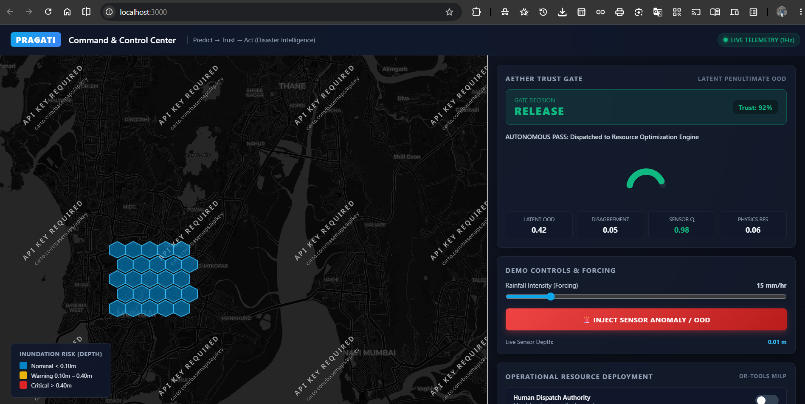

# PRAGATI: Predictive Resilience & Adaptive Governance Intelligence

> **Predict → Trust → Act**  
> *A Reliability-Gated Disaster Intelligence Platform for Urban Flooding & Waterlogging*  
> **Problem Statement ID**: 26178 | **Category**: Hardware / Disaster Management | **Team**: PRELUDE

---

## 📌 Project Overview

Urban flooding in Indian metropolitan cities is rapid, spatially heterogeneous, and catastrophic. Conventional disaster pipelines stop at simple weather forecasting or gauge alerts, failing to translate raw data into reliable, actionable emergency response. Furthermore, deploying black-box AI models directly into emergency command centres introduces massive operational hazards: during extreme cloudbursts or sensor malfunctions, uncalibrated AI models can hallucinate or fail silently, leading to misplaced resources and lost lives.

**PRAGATI** transforms urban flood management by establishing a closed operational loop: **Predict → Trust → Act**. Using an Uber H3 terrain-aware spatial graph, a **Physics-Guided Spatio-Temporal Graph Neural Network (PG-STGNN)** forecasts multi-horizon inundation depth while enforcing water mass conservation. Crucially, raw forecasts never trigger emergency resources autonomously. Instead, **AETHER**—a patented-design reliability gate evaluating latent out-of-distribution (OOD) distance, multi-model ensemble disagreement, sensor telemetry health, and physics residuals—acts as a circuit breaker to release, refine, or abstain. Trusted states are then fed into an OR-Tools MILP optimizer to recommend differentiated pump dewatering and boat rescue operations, with mandatory **Human-in-the-Loop** command authority.

---

## 🌟 Key Features

- **Live Geospatial Telemetry & Spatial Grid**: Represents urban topographies via hierarchical Uber H3 hexagonal cells with real-time water depth and dynamic inundation risk classification.
- **AETHER Reliability Gate (Circuit Breaker)**: Evaluates predictions across 4 distinct dimensions (Mahalanobis latent OOD distance, ensemble variance, sensor quality score, and continuity physics residual) into three operational states: **RELEASE**, **REFINE**, or **ABSTAIN**.
- **Interactive Anomaly Injection**: Live demonstration trigger simulating sensor corruption, communication dropouts, or unprecedented distribution shifts to showcase graceful AI abstention.
- **Constrained Resource Optimization**: Dispatches resources based on distinct physical dynamics—**Pumps** (water volume & depth reduction) vs. **Rescue Boats** (reachability to cutoff sectors).
- **Mandatory Human Governance**: Enforces operational authority where consequential dispatches require explicit operator approval before downstream execution.

---

## 🛠️ Tech Stack

| Layer | Technologies |
| :--- | :--- |
| **Frontend Dashboard** | React 18, React-Leaflet (OpenStreetMap Dark Basemaps), Recharts, Vanilla CSS Glassmorphism |
| **Backend API & Engine** | FastAPI, Uvicorn, WebSockets (1Hz bidirectional streaming), Pydantic v2, Python 3.10+ |
| **Optimization & ML Core**| PG-STGNN (GraphSAGE + GRU), Continuity Regularization ($\Delta V \approx P + I - O - F$), Google OR-Tools MILP |
| **Hardware & IoT Edge** | ESP32 Microcontroller, JSN-SR04T Waterproof Ultrasonic Depth Sensor, Local Wi-Fi / MQTT |

---

## 📸 System Screenshot



---

## 🚀 Quick Start Guide

### Prerequisites
- Python 3.10 or higher
- Node.js (v18+) and npm
- Git

### 1. Clone the Repository
```bash
git clone https://github.com/JayKalbi/PRAGATI.git
cd PRAGATI
```

### 2. Backend Setup
```bash
# Navigate to backend
cd backend

# Create and activate virtual environment
python -m venv pragati
# Windows:
.\pragati\Scripts\activate
# Linux/macOS:
source pragati/bin/activate

# Install dependencies
pip install -r requirements.txt

# Start the FastAPI server
uvicorn main:app --reload --port 8000
```
*The backend API will be live at `http://localhost:8000` (Interactive Swagger Docs at `http://localhost:8000/docs`).*

### 3. Frontend Setup
Open a second terminal window:
```bash
# Navigate to frontend
cd frontend

# Install dependencies
npm install

# Start the React application
npm start
```
*The Command Center will open automatically in your browser at `http://localhost:3000`.*

---

## 🏛️ Architecture: Predict → Trust → Act

```
[IoT Sensor / Tank] ──► [FastAPI & WebSockets] ──► [PG-STGNN Forecast]
                                                           │
                                                           ▼
                                                 [AETHER TRUST GATE]
                                                ┌──────────┼──────────┐
                                                ▼          ▼          ▼
                                            RELEASE     REFINE     ABSTAIN
                                                │          │          │
                                                ▼          ▼          ▼
                                        [MILP Engine]  [Simulator] [Human Alert]
                                                │                     │
                                                └──────────┬──────────┘
                                                           ▼
                                              [HUMAN COMMAND APPROVAL]
                                                           │
                                                           ▼
                                            [PUMPS & BOATS DISPATCHED]
```

---

## 👥 Team PRELUDE
- **Problem Statement**: 26178
- **Smart India Hackathon (SIH 2026)**
